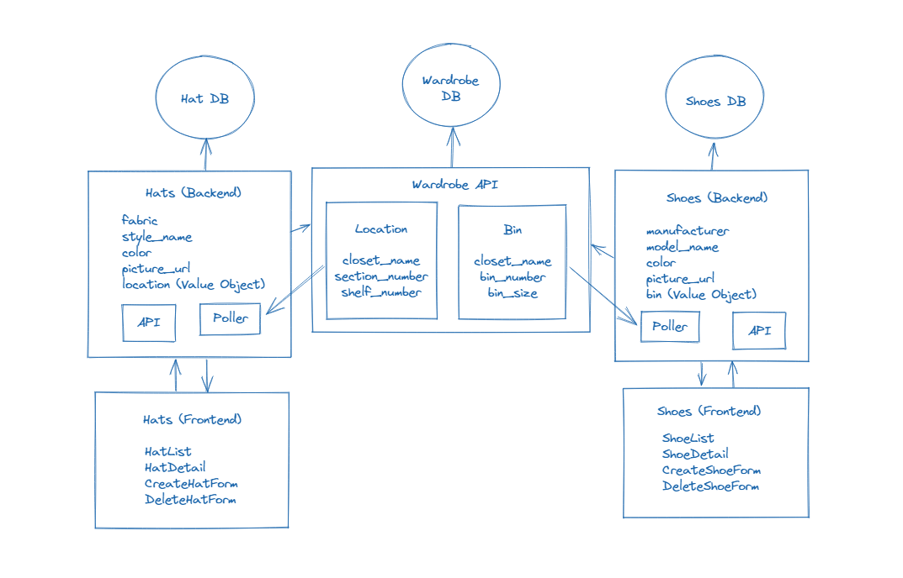

# Wardrobify

Team:

- Ryan - Hats
- Isaiah - Shoes

## Design

This application allows a user to create, delete, and view instances of hats and shoes. These hats and shoes are placed in locations and bins, which are polled from the Wardrobe API.



## Shoes microservice

The shoes model allows a user to add a shoe to a bin according to the manufacturer, model name, color, and a picture.
The bin model is a value object polled from the Wardrobe API, and has the following fields: closet name and import href.
In order to create shoes, it is necessary to have a bin to place it in. Since the bins exist in the Wardrobe database,
it is necessary to create a poller to create a copy of the Bins relational table that will then exist in the Shoes database.

## Hats microservice

The hat model allows a user to add a fabric, style name, color, picture, and location to a hat.
The location model is a value object polled from the Wardrobe API, and has the following fields: closet name and import href.
In order to create a hat, it is necessary to have a location to place it in. Since the locations exist in the Wardrobe database,
it is necessary to create a poller to create a copy of the Location relational table that will then exist in the Hats database.

### Restful API endpoints for shoes

Base URL: http://localhost:8080

| Method | URL                  | What it does                                     |
| ------ | -------------------- | ------------------------------------------------ |
| GET    | /api/shoes/          | Gets a list of all the shoes                     |
| GET    | /api/shoes/\<int:pk> | Gets the details of a pair of shoes              |
| POST   | /api/shoes           | Creates a new pair of shoes with the posted data |
| PUT    | /api/shoes/\<int:pk> | Updates the details of a pair of shoes           |
| DELETE | /api/shoes/\<int:pk> | Deletes a single pair of shoes                   |

### Restful API endpoints for hats

Base URL: http://localhost:8090

| Method | URL                 | What it does                           |
| ------ | ------------------- | -------------------------------------- |
| GET    | /api/hats/          | Gets a list of all the hats            |
| GET    | /api/hats/\<int:pk> | Gets the details of one hat            |
| POST   | /api/hats           | Creates a new hat with the posted data |
| PUT    | /api/hats/\<int:pk> | Updates the details of one hat         |
| DELETE | /api/hats/\<int:pk> | Deletes a single hat                   |

### Restful API endpoints for bins

Base URL: http://localhost:8100

| Method | URL                 | What it does                           |
| ------ | ------------------- | -------------------------------------- |
| GET    | /api/bins/          | Gets a list of all the bins            |
| GET    | /api/bins/\<int:pk> | Gets the details of one bin            |
| POST   | /api/bins           | Creates a new bin with the posted data |
| PUT    | /api/bins/\<int:pk> | Updates the details of one bin         |
| DELETE | /api/bins/\<int:pk> | Deletes a single bin                   |

### Restful API endpoints for locations

Base URL: http://localhost:8100

| Method | URL                      | What it does                                |
| ------ | ------------------------ | ------------------------------------------- |
| GET    | /api/locations/          | Gets a list of all the location             |
| GET    | /api/locations/\<int:pk> | Gets the details of one location            |
| POST   | /api/locations           | Creates a new location with the posted data |
| PUT    | /api/locations/\<int:pk> | Updates the details of one location         |
| DELETE | /api/locations/\<int:pk> | Deletes a single location                   |

## Development

Run the following commands to start the application:

- docker volume create pgdata
- docker-compose build
- docker-compose up

Then navigate to the web application at http://localhost:3000/

## How to create a pair of shoes

1. Create a bin.
   - a. Use software such as Insomnia to create a POST request to http://localhost:8100/api/bins/
   - b. Create a POST request in JSON in the following format (you can copy paste the sample code):
     ```
         {
             "closet_name": "Basketball",
             "bin_number": 1,
             "bin_size": 10
         }
     ```
   - c. Insomnia should return a JSON object that would look like this:
     `        {
            "href": "/api/bins/1/",
            "id": 1,
            "closet_name": "Basketball",
            "bin_number": 1,
            "bin_size": 10
        }
   `
     OR via Superuser
   - A. Access the wardrobe-api-1 docker container terminal.
   - B. Type out this command:
     ```
     python manage.py createsuperuser
     ```
   - C. Follow the prompts and remember your username and password!
   - D. Access http://localhost:8100/admin
   - E. Click the "+ Add" button in the "Bins" row.
   - F. Fill out the necessary information and click Save!
2. Access localhost:3000 and find the link to "Create shoes" in the navigation bar.
3. Input the necessary information and choose your closet of choice from the dropdown menu.
4. Click the "Create" button and you will receive a success message!
5. Click the "Shoes" link in the navigation bar.
6. Congratulations! Your Shoes should appear! If you cannot see a table of all the pairs of shoes you have created, please make sure your address bar is set to "localhost:3000/shoes/"
7. (Optional) To delete a pair of shoes, simply press the "Delete" button and it is gone! Easy as that!

## How to create a hat

1. Create a location.
   - a. Use software such as Insomnia to create a POST request to "http://localhost:8100/api/locations/"
   - b. Create a POST request in JSON in the following format (you can copy paste the sample code):
     ```
         {
             "closet_name": "Snapbacks",
             "section_number": 1,
             "shelf_number": 10
         }
     ```
   - c. Insomnia should return a JSON object that would look like this:
     `        {
            "href": "/api/locations/1/",
            "id": 1,
            "closet_name": "Snapbacks",
            "section_number": 1,
            "shelf_number": 10
        }
   `
     OR via Superuser
   - A. Access the wardrobe-api-1 docker container terminal.
   - B. Type out this command:
     ```
     python manage.py createsuperuser
     ```
   - C. Follow the prompts and remember your username and password!
   - D. Access http://localhost:8100/admin
   - E. Click the "+ Add" button in the "Locations" row.
   - F. Fill out the necessary information and click Save!
2. Access localhost:3000 and find the link to "Create a hat" in the navigation bar.
3. Input the necessary information and choose your location of choice from the dropdown menu.
4. Click the "Create" button and you will receive a success message!
5. Click the "Hats" link in the navigation bar.
6. Congratulations! Your Hats should appear! If you cannot see a table of all the Hats you have created, please make sure your address bar is set to "localhost:3000/hats/"
7. (Optional) To delete a pair of hats, simply press the "Delete" button and it is gone! Easy as that!
